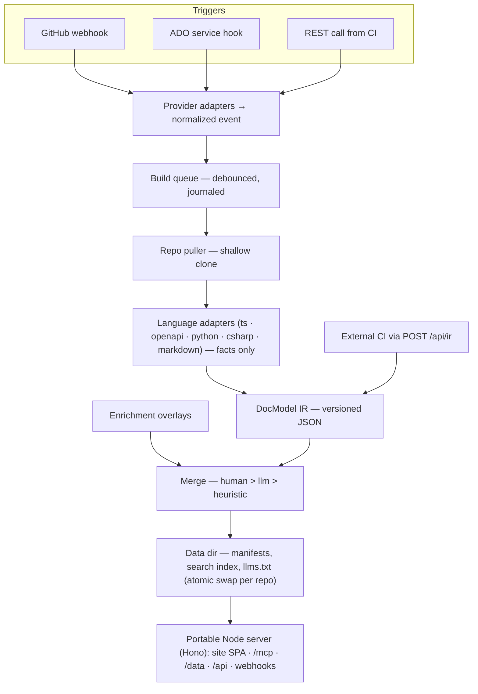

# Architecture

necronomidoc is a self-hostable documentation server for a team's repos. It
pulls source repositories when they change, extracts documentation from code
via language adapters, merges a curated/LLM enrichment layer, and publishes
two synchronized outputs from the same doc model:

1. **An interactive web doc site** — a TypeScript React SPA (Vite +
   React Router, daisyUI components).
2. **An MCP endpoint** — a stateless streamable-HTTP server answering
   per-file/per-function purpose queries from build-time JSON manifests, so
   coding agents can understand scope and separation of concerns, find
   existing code, and avoid duplicating it.

Everything runs as **one portable Node process with filesystem-only state** —
deployable on a single EC2 instance, an Azure App Service, an on-prem box, or
a laptop ([decision 0002](decisions/0002-hosting-portability.md)).

## The pipeline



An external repo whose language the host has no toolchain for can extract in
its own CI and `POST /api/ir` — publication downstream of extraction is
identical ([decision 0013](decisions/0013-backend-adapters-toolchains.md)).

## Design properties

These hold across the whole system; the [decision register](decisions/README.md)
records why each was chosen.

- **One process, filesystem state.** No database, no sidecar services. The
  data dir (`DOCS_DATA_DIR`) is the entire state — back it up and you can
  rebuild the host from nothing ([0002](decisions/0002-hosting-portability.md)).
- **The server pulls; adapters extract facts only.** The central server
  shallow-clones registered repos and runs extraction itself
  ([0003](decisions/0003-central-server-pull-ingestion.md)). Adapters emit a
  versioned, file-rooted JSON intermediate representation — the **DocModel**
  ([0006](decisions/0006-intermediate-representation.md)) — and never
  editorialize; interpretation lives in the enrichment layer.
- **Enrichment is an overlay with fixed precedence.** Human-curated content
  beats LLM output beats an always-present heuristic floor, per target
  ([0004](decisions/0004-enrichment-layer.md)). Human overlays are never
  auto-overwritten; when the code under them changes they are flagged stale.
- **Only successful builds publish, atomically.** Each repo's manifests are
  swapped in one rename; a failing build keeps the previous docs serving.
- **MCP is manifests + a stateless handler.** Everything MCP serves was
  computed at build time; the handler holds no session state
  ([0008](decisions/0008-mcp-serving.md)).
- **Providers and toolchains are adapters.** Git triggers
  ([0001](decisions/0001-git-provider-adapter.md)), languages
  ([0007](decisions/0007-extraction-stack-typescript.md),
  [0013](decisions/0013-backend-adapters-toolchains.md)), and LLM providers
  ([0016](decisions/0016-llm-provider-agnostic.md)) each sit behind a small
  interface, so adding one changes no core code.
- **Auth is all-or-nothing on one shared token.** Opt-in team-private mode:
  session cookies for browsers, `Authorization: Bearer` for MCP/API;
  reverse-proxy SSO is the supported alternative
  ([0014](decisions/0014-auth-baseline.md)).

## Monorepo layout (npm workspaces)

| Package | Role |
|---------|------|
| `packages/docmodel` | Versioned file-rooted IR + enrichment/manifest schemas (Zod), stable IDs, hashing |
| `packages/adapter-ts` | TypeScript/React extraction (ts-morph sweep, JSDoc, components, prop tables) |
| `packages/adapter-markdown` | Markdown prose extraction (READMEs, `docs/` pages, heading sections) |
| `packages/adapter-openapi` | OpenAPI 3.x spec extraction (validate + bundle, one `endpoint` symbol per operation) |
| `packages/adapter-python` | Python extraction via pinned `griffe dump` (static analysis, out of process) |
| `packages/adapter-csharp` | C#/.NET extraction via `docfx metadata` ManagedReference YAML (Roslyn-driven, out of process) |
| `packages/enrichment` | Heuristic + LLM purpose producers, overlay loader, precedence merge, staleness reports, subsystem maps, LLM provider clients |
| `packages/mcp` | Manifest builder + MCP tools over a stateless streamable-HTTP handler |
| `packages/server` | Hono server: site + `/data` + `/mcp` + webhooks + build API + auth + structured logs, journaled build queue, skills/artefacts endpoints |
| `packages/cli` | The `necronomidoc` command — see the [usage guide](usage.md) |
| `packages/site` | React + Vite + React Router SPA doc site, client-side search, this help section |

## The data dir

Default `./.necronomidoc-data` (`/data` in the container):

```
repos.json            watched-source registry (curated — back up)
registry.json         built-docs manifest (which repos are published)
enrichment/<slug>/    human + LLM overlays, core-doc overrides (curated — back up)
repos/<slug>/         published manifests: docmodel, search index, coredocs, llms.txt
clones/<id>/          persistent shallow clones (regenerable)
skills/  artefacts/   generated skill sets and filled templates
status.json           build history        queue.json   trigger journal
meta.json             schema-version stamp (guards binary/data mismatches)
```

Only `registry.json` and `repos/**` are ever served over HTTP (`/data/*` is a
deny-by-default allowlist); clones, logs, and queue state stay private.
