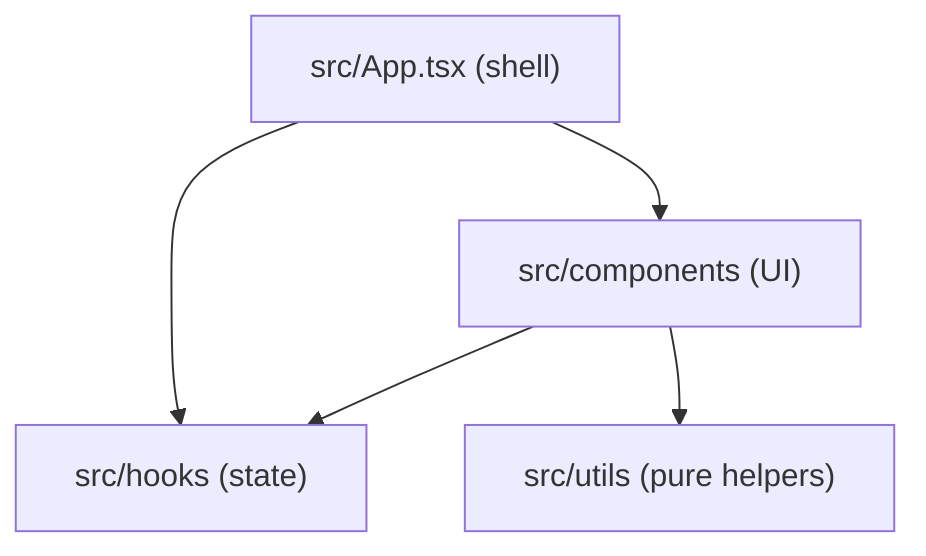

# Sample app architecture

Repo-provided core doc (slice 7): this file ships with the source repo at
`.necronomidoc/docs/architecture.md`, so it outranks server overrides and
LLM-generated versions.

- **UI** renders whatever state the hooks expose; no business logic.
- **State hooks** own the counter state machine; nothing persists.
- **Utilities** are framework-free formatting helpers.
